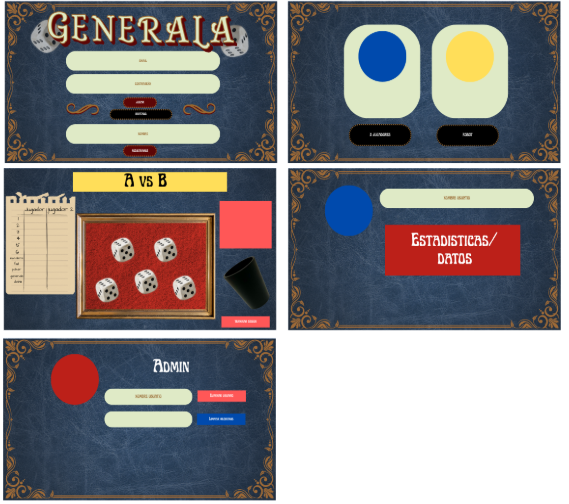
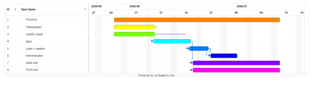

# 2026_TPIN1_G11

# **Proyecto interdisciplinario**

## **Primer cuatrimestre**

### Título de la propuesta: _Generala_ Grupo: 11 División: B

**Integrantes:**

Mercedes Tiziana Allievi  
Ánika Baldesari  
Thiago Ibarzabal  
Victoria Kutianski

**Descripción de la propuesta**

Vamos a hacer una Generala, que se puede jugar contra un bot o, si es posible, con dos personas en la misma PC. Como referencia, este es el [reglamento de la Generala](https://ruibalgames.com/wp-content/uploads/2015/11/Reglamento-Generala.pdf). Todas las reglas se van a aplicar en nuestra app.

El jugador que comienza se determina de forma aleatoria. Debajo van a haber cinco dados que puede tirar hasta tres veces. Va a ser capaz de bloquear y desbloquear cada uno como le parezca conveniente para que no cambie su valor. En la pantalla también van a estar la tabla del jugador para rellenar, y la tabla del bot que se rellenará automáticamente. Cuando el jugador elija en dónde quiere sumar su puntaje o si quiere descartar una categoría, el turno va a pasar al bot o al otro jugador.

Cuando se hayan completado todas las categorías del juego, se van a sumar los valores para llegar a un puntaje final de cada jugador. Gana el que tenga el mayor número. Una vez termina la partida, se guarda si el usuario ganó, perdió o empató, y se agrega como una de las estadísticas disponibles en el perfil del usuario.

La temática visual de la app va a estar inspirada en una Buenos Aires antigua con ornamentos dorados, una tipografía elegante y texturas sofisticadas como el cuero para el fondo. La paleta de colores va a incluir bordó, azul oscuro, dorado, blanco y negro.

**Bocetos de la interfaz de la aplicación**  

**Alcance**

- Dos modos de juego: jugador contra jugador en el mismo ordenador, y jugador contra máquina. En el jugador contra jugador, el jugador 1 es el usuario registrado y el otro juega como invitado. Únicamente se guardan las estadísticas del jugador 1\.
- Perfil de usuario con estadísticas disponibles: ganadas, perdidas, empatadas y récord de puntaje.
- Pestaña con el reglamento del juego.

**Tareas**

1. Presupuesto (08/6)
2. Diseño visual de cada pestaña (08/6)
   1. Inicio de sesión y registro
   2. Juego principal
3. Diseño de la base de datos (18/6)
   1. usuarios (id, nombre, apellido, nombre de usuario, contraseña)
   2. estadísticas (id, id usuario, cantidad ganadas, cantidad empatadas, cantidad perdidas, porcentaje de victorias)
4. Creación de la base de datos en MySQL
5. Login y registro (25/6)
   1. HTML y CSS
   2. JS
6. Usuario administrador (02/7)
   1. Borrar usuarios
   2. Reiniciar estadísticas de los usuarios
7. Front-end
   1. HTML
      1. Inicio de sesión
      2. Elegir tipo de juego
      3. Juego
      4. Perfil del usuario
      5. Panel de administrador
   2. CSS
   3. JS
      1. DOM
      2. Funciones para el GET, PUT, POST y DELETE
      3. Funciones propias del juego
8. Back-end (JS)
   1. Pedidos GET, PUT, POST y DELETE
9. Testeo

**Responsabilidades (sujeto a cambios)**

1. Allievi y Ibarzabal
2. Baldesari y Kutianski
3. Ibarzabal
4. Ibarzabal
5. a. Baldesari  
   b. Kutianski
6. Kutianski
7. a. b. Baldesari  
   c. i. ii. Allievi  
   c. iii. Baldesari
8. Allievi
9. Todos

**Diagrama Gantt**  

